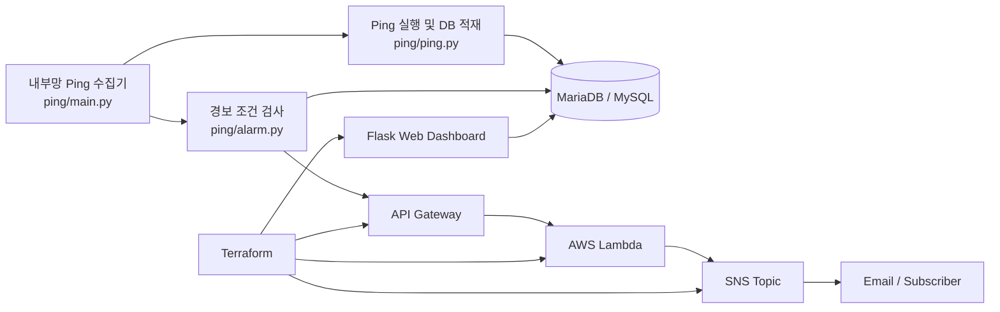

# provisioning_monitor

사내 네트워크 장비 상태를 주기적으로 점검하고, 결과를 저장·시각화·경보로 연결하는 모니터링 프로젝트입니다.  
운영 환경의 불편을 작은 자동화 도구로 해결하고, 이를 데이터 저장/시각화/알림 파이프라인으로 확장하는 흐름을 다룹니다.

---

## 1. 프로젝트 개요

네트워크 장애가 발생해도 관리자 권한이나 장비 로그 접근 권한이 제한된 환경에서는 원인 추적이 어렵습니다. 이 프로젝트는 이런 제약을 전제로 다음 흐름을 구성합니다.

1. 내부망에서 공유기/네트워크 대상에 대해 주기적으로 `ping` 수행
2. 결과를 DB에 저장하여 상태 이력 확보
3. 웹 대시보드에서 최신 상태 확인
4. 일정 임계치를 넘는 장애 패턴이 감지되면 AWS Lambda + SNS로 알림 전송

즉, 이 프로젝트는 단순 `ping` 스크립트가 아니라 **수집 → 저장 → 판단 → 시각화 → 경보**의 전체 운영 흐름을 다루는 모니터링 시스템입니다.

---

## 2. 문제 정의

### 배경
- 특정 네트워크 장비에 대한 관리자 권한이 제한되어 있음
- 장비 자체 로그가 충분하지 않거나 지속적으로 보존되지 않음
- 장애가 일시적으로 발생했다가 복구되면 사후 분석이 어려움

### 해결하고자 한 문제
- 장비 상태를 외부에서 지속적으로 추적할 수 있는가?
- 장애 징후를 사람이 상시 확인하지 않아도 감지할 수 있는가?
- 장애 발생 시 웹 UI와 알림으로 빠르게 공유할 수 있는가?

### 핵심 아이디어
- 장비 내부 로그 대신 ICMP 기반 헬스체크를 사용
- 결과를 중앙 DB에 적재해 시계열 이력을 확보
- 최근 10분 기준으로 장애/지연 조건을 판단해 경보 자동화

---

## 3. 주요 기능

### 3-1. Ping 기반 상태 수집
- DB의 `router_config` 테이블에서 대상 장비 목록 조회
- 각 장비에 대해 `ping` 실행
- 응답 성공 시 시간, RTT, TTL 등을 `ping_log`에 저장
- 응답 실패 시 `error_monitor`에 기록

### 3-2. 장애 조건 판단
- 최근 10분 데이터를 기준으로 다음 조건을 검사
    - **응답 없음**: 최근 10분 동안 응답 기록이 없는 장비 수
    - **속도 저하**: 최근 10분 동안 모든 응답이 100ms 초과인 장비 수
- 임계치(현재 코드 기준 10대 이상)를 넘으면 경보 대상 생성

### 3-3. 웹 대시보드
- 장비별 최신 상태를 조회하여 UI에 표시
- 위치, IP, 최근 응답 시간, 마지막 확인 시각을 한눈에 확인 가능
- 테이블 정렬 UI를 염두에 둔 구조로 설계

### 3-4. AWS 기반 경보 알림
- 내부망 수집기가 API Gateway 엔드포인트로 경보 요청 전송
- Lambda가 SNS 토픽에 메시지를 발행
- 이메일 등 SNS 구독 채널로 장애 전파

---

## 4. 기술 스택

### Backend / Application
- Python 3.11
- Flask
- PyMySQL
- requests
- sshtunnel
- python-dotenv

### Infrastructure / Cloud
- AWS Lambda
- AWS API Gateway
- AWS SNS
- AWS EC2
- AWS ALB
- AWS Route53
- Terraform

### Runtime / Operation
- Docker
- cron
- MariaDB 또는 MySQL 계열 DB

---

## 5. 시스템 아키텍처



### 흐름 요약
1. 내부망 수집기가 라우터 상태를 점검합니다.
2. 수집 결과가 DB에 저장됩니다.
3. 알림 조건이 만족되면 API Gateway를 통해 Lambda가 호출됩니다.
4. Lambda는 SNS로 알림을 발행합니다.
5. 웹 대시보드는 DB의 최신 상태를 조회해 운영자가 확인할 수 있게 합니다.

---

## 6. 디렉토리 구조

```text
provisioning_monitor/
├── lambda/         # AWS Lambda 알림 함수
├── ping/           # 내부망 상태 수집기 및 경보 조건 판별
├── terraform/      # AWS 인프라 정의 초안
└── web/            # Flask 기반 상태 대시보드
```

### 상세 설명
- `lambda/`
    - SNS 발행용 Lambda 함수가 위치합니다.
    - API Gateway에서 전달된 이벤트를 받아 알림 전송을 담당합니다.

- `ping/`
    - 주기 실행 진입점 `main.py`
    - 실제 Ping 수행 및 DB 저장 `ping.py`
    - 임계치 기반 경보 판단 및 Lambda 호출 `alarm.py`
    - Docker + cron으로 주기 실행되도록 구성

- `terraform/`
    - EC2, ALB, API Gateway, Lambda, SNS, Route53 관련 인프라 정의 파일

- `web/`
    - Flask 앱과 DB 조회 로직, 템플릿, 정적 파일 포함
    - 최신 네트워크 상태를 대시보드 형태로 제공

---

## 7. 현재 구현 기준 역할 분리

### `ping`
네트워크 상태 수집과 장애 판별의 핵심 모듈입니다.

- `main.py`
    - 수집과 경보 판별을 순차 실행하는 엔트리포인트
- `ping.py`
    - SSH 터널을 열고 DB에 접속
    - 라우터 목록 조회
    - 각 라우터에 `ping`을 보내고 결과를 DB에 적재
- `alarm.py`
    - 최근 10분 데이터를 기반으로 장애 조건을 판단
    - 쿨다운 파일을 사용해 알림 중복 전송 방지

### `web`
운영자가 상태를 확인하는 조회 계층입니다.

- `db.py`
    - 라우터 최신 상태 조회
    - DB 결과를 화면 표시용 데이터 구조로 변환
- `app.py`
    - Flask 라우팅과 렌더링 담당

### `lambda`
알림 전달 계층입니다.

- `main.py`
    - API Gateway 요청을 받아 SNS로 발행
    - 현재는 메시지 본문보다 발행 트리거에 초점이 맞춰져 있음

### `terraform`
인프라 자동화 계층입니다.

- AWS 리소스 생성을 코드로 관리하려는 목적

---

## 8. 실행 방법

> 아래는 **현재 저장소 기준으로 가장 현실적인 실행 순서**입니다.  
> `terraform/`은 아직 보완이 필요하므로, 우선 `ping/`과 `web/` 중심으로 로컬/서버 실행을 권장합니다.

### 8-1. 공통 환경 변수 준비

각 실행 환경에서 아래 값을 `.env`로 관리합니다.

```env
DB_HOST=your-db-host
DB_PORT=3306
DB_USER=your-db-user
DB_PASS=your-db-password
DB_NAME=your-db-name

SSH_CONF=your-ssh-host-alias
SSH_PATH=/path/to/ssh/config

LAMBDA_URL=https://your-api-gateway-endpoint/alerts
```

### 8-2. Ping 수집기 실행

```bash
cd ping
docker compose up --build
```

- 컨테이너 내부에서 cron이 2분마다 `main.py`를 실행합니다.
- `main.py`는 `ping.py`와 `alarm.py`를 순차 실행합니다.

### 8-3. 웹 대시보드 실행

```bash
cd web
docker compose up --build
```

- 기본 포트는 `5000`입니다.
- 브라우저에서 `http://localhost:5000`으로 접속합니다.

### 8-4. Lambda 배포

- `lambda/main.py`를 패키징한 뒤 Lambda 함수로 업로드합니다.
- API Gateway와 SNS Topic ARN을 실제 값으로 연결해야 합니다.
- 현재 코드는 하드코딩된 ARN을 사용하므로 환경변수화가 필요합니다.

### 8-5. Terraform 적용 전 확인 사항

현재 `terraform/`은 그대로 `apply`하기보다 아래 작업이 선행되어야 합니다.

- 실제 VPC/Subnet/Security Group 참조 방식 정리
- Lambda 핸들러명 및 패키징 경로 수정
- API Gateway Stage/Permission/Deployment 정의 보완
- Route53 alias 대상 수정
- 하드코딩된 예시 값 제거

---

## 9. 경보 / 알림 흐름 설명

현재 코드의 경보 흐름은 다음과 같습니다.

1. `ping.py`가 공유기 상태를 수집해 DB에 적재
2. `alarm.py`가 최근 10분 데이터를 조회
3. 아래 조건 중 하나라도 충족하면 경보 메시지 생성
     - 최근 10분 응답 없음 장비가 10대 이상
     - 최근 10분 동안 100ms 초과 응답만 기록된 장비가 10대 이상
4. 최근 30분 내에 이미 동일한 경보를 보냈다면 쿨다운으로 전송 생략
5. 쿨다운이 없으면 API Gateway로 POST 요청 전송
6. Lambda가 SNS Topic에 메시지를 발행
7. SNS 구독자(예: 이메일)가 경보를 수신

### 설계 의도
- 운영자가 웹을 항상 열어두지 않아도 장애를 인지할 수 있게 함
- 일시적인 튐이 아닌 “지속된 이상 상태”에 반응하도록 최근 10분 윈도우 사용
- 경보 폭주를 막기 위해 쿨다운 파일 적용

---

## 10. 트러블슈팅 / 개선 포인트

### 10-1. 현재 구조에서 바로 보이는 개선점

1. **환경변수 검증 부족**
     - 필수 환경변수가 없을 때 즉시 실패하지 않고 런타임 오류로 이어질 수 있습니다.

2. **DB 연결/SSH 터널/프로세스 실행 책임이 한 파일에 집중**
     - `ping.py`가 터널 생성, DB 접속, Ping 실행, 파싱, 적재를 모두 담당합니다.

3. **예외 처리와 로그 구조 미흡**
     - `print()` 중심이며 구조화 로그가 없어 운영 추적성이 낮습니다.

4. **Terraform 완성도 부족**
     - 현재는 문서화/설계 초안 수준으로, 실제 배포 전 수정이 필요합니다.

5. **웹 서비스 운영 설정 미흡**
     - Flask 개발 서버 기반 실행이며 인증/접근제어가 없습니다.

### 10-2. 구조적 개선 방향

- `config.py`, `db.py`, `services/`, `repositories/` 구조로 책임 분리
- `.env.example` 제공 및 필수 값 검증 추가
- `logging` 기반 JSON 로그 또는 구조화 로그 적용
- 예외 상황별 재시도/타임아웃/실패 원인 기록 강화
- API Gateway 호출에 인증 토큰 또는 서명 방식 도입
- 웹 대시보드에 최근 장애 건수, 평균 RTT, 마지막 장애 시각 등 요약 카드 추가
- Terraform을 모듈화하고 `variables.tf`, `outputs.tf`를 분리
- Lambda, Web, Ping 각각에 대해 아키텍처/시퀀스 다이어그램 추가